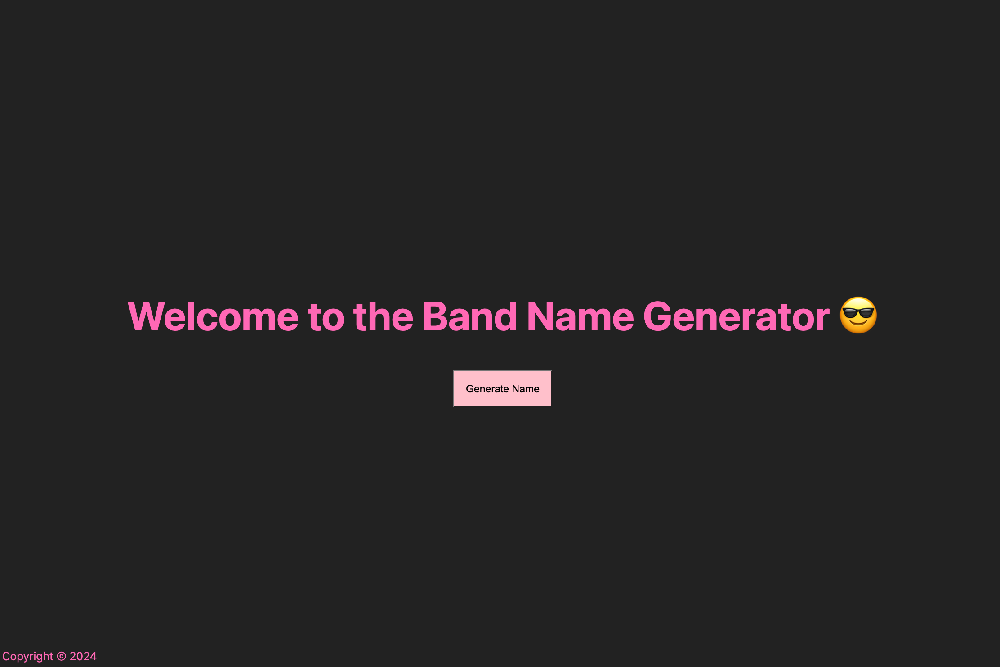

# Band Name Generator

## Description

This project is a web application built using Express.js and EJS templating engine. It generates random band names by combining adjectives and nouns. The application serves as a fun way to come up with unique and creative names for bands.

The project was completed as part of the [The Complete 2021 Web Development Bootcamp](https://www.udemy.com/course/the-complete-web-development-bootcamp/) course on Udemy.



## Key Learnings

- **Express.js and EJS Integration**: Learned to set up an Express server and render views using the EJS templating engine.
- **Static File Serving**: Gained experience in serving static files like CSS for styling the web application.
- **Form Handling and POST Requests**: Improved understanding of handling form submissions and POST requests in Express.js.
- **Randomization Logic**: Implemented simple logic to randomly select elements from arrays, providing a different band name upon each request.

## Installation

Clone the repository:

```bash
git clone https://github.com/lappemic/udemy-ejs-project.git
cd udemy-ejs-project
npm install
```

## Usage

Start the application:
```bash
node index.js
```
or using nodemon:
```bash
nodemon index.js
```

Navigate to `http://localhost:3000` in your web browser. Click the "Generate Name" button to see a new random band name.

## Project Structure

- `index.js`: Main server file configuring Express and routes.
- `views/index.ejs`: The EJS template for the main page, displaying the band name generator.
- `views/partials/header.ejs` and `views/partials/footer.ejs`: Partial templates for the header and footer included in the main page.


